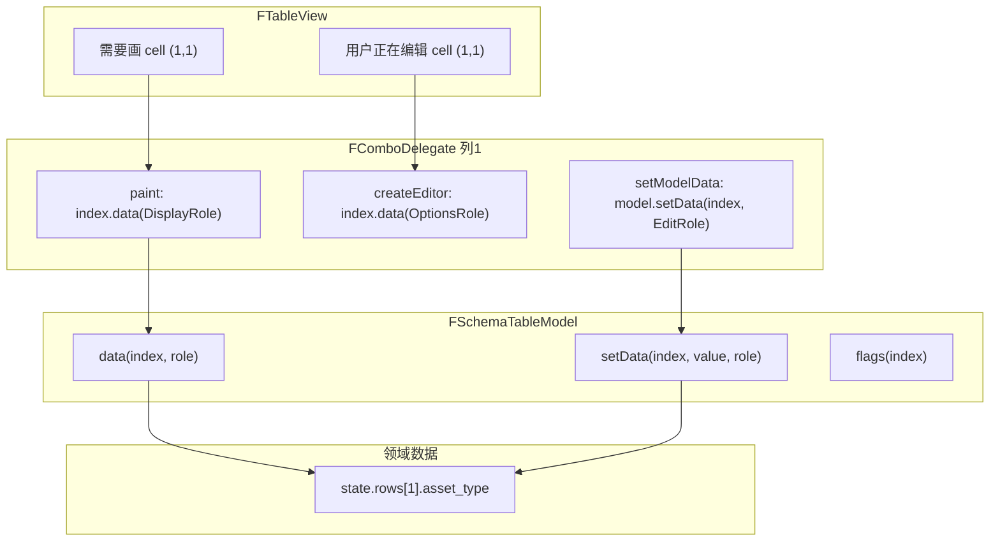

# Row / Column / Cell / Index / Role 详解

> 基于 `forza_ui` 的 `AssetRow` + `FSchemaTableModel` + `FComboDelegate`，说明 Qt 表格核心概念及 MVC 架构下的数据流。

---

## 一、先建立一张「物理表格」的直觉

假设 `examples/mvc_table_example.py` 里有 3 行数据，列 schema 是：

| 列号 | key | title | cell_type |
|------|-----|-------|-----------|
| 0 | name | 名称 | text |
| 1 | asset_type | 类型 | combo |
| 2 | enabled | 启用 | check |
| 3 | count | 数量 | spin |
| … | … | … | … |

`state.rows` 里是：

```python
rows[0] = AssetRow("Camera_A", "相机", True, 2, "完成")
rows[1] = AssetRow("Char_Hero", "角色", True, 1, "进行中")
rows[2] = AssetRow("Env_City", "场景", False, 5, "待开始")
```

在屏幕上就是：

```
        列0      列1      列2    列3
行0   Camera_A   相机      ✓      2
行1   Char_Hero  角色      ✓      1
行2   Env_City   场景      ✗      5
```

下面每个词都对应这张表里的某个概念。

---

## 二、五个核心概念分别是什么

### 1. Row（行）— 两层含义

| 含义 | 是什么 | 在你项目里 |
|------|--------|----------|
| **业务行** | 一条业务记录 | 一个 `AssetRow` 对象 |
| **行号** | 在列表里的位置 | `0, 1, 2, …`，即 `index.row()` |

```python
# 业务数据（MVC 的 M 真正持有的）
self._model.state.rows[1]   # → AssetRow(name="Char_Hero", ...)

# Qt 里的行号
index.row()  # → 1  （表示「第 2 行」，从 0 开始）
```

**一行 = 一个 `AssetRow`**，行号只是它在 `state.rows` 列表里的下标。

---

### 2. Column（列）— 也是两层

| 含义 | 是什么 | 在你项目里 |
|------|--------|----------|
| **列号** | 从左到右第几列 | `0, 1, 2, …`，即 `index.column()` |
| **字段 key** | 这列对应行对象哪个属性 | schema 里的 `"name"`, `"asset_type"`, `"enabled"` |

```python
# 列号 → schema 定义
schema[1]  # ColumnDef(key="asset_type", cell_type=COMBO, ...)

# 列号 + 行对象 → 读字段
row = rows[1]
getattr(row, "asset_type")  # → "角色"
```

**一列 = schema 里的一列定义**，决定这列显示什么字段、用什么 Delegate。

---

### 3. Cell（单元格）— 行和列的交点

**一个 cell = 某行的某个字段**，例如：

- 行 1、列 1 → `rows[1].asset_type` → 显示 `"角色"`
- 行 0、列 3 → `rows[0].count` → 显示 `2`

用坐标写就是 `(row_index, column_index)`，例如 `(1, 1)`。

**cell 不是单独的对象**，只是「第几行第几列」这一个交叉点；真正的数据永远在 `AssetRow` 的某个属性上。

---

### 4. Index（`QModelIndex`）— Qt 用来「指着某一格」的句柄

`QModelIndex` 是 Qt 的**定位符**，告诉系统：「我要操作 Model 里的哪一格」。

它主要包含：

- `index.row()` → 行号
- `index.column()` → 列号
- 内部还绑定了是哪个 `QAbstractItemModel`（以及 Proxy 链里的映射）

创建方式（在 `FSchemaTableModel` 里）：

```python
idx = model.index(row_index=1, column_index=2)  # 第2行、第3列（enabled）
```

View / Delegate 拿到的 `index`，都是这种「指着某一格」的句柄，**不是** `AssetRow` 本身。

若用了 `FTableViewSet` 的 Proxy 链：

```
View 上的 index  →  mapToSource  →  FSchemaTableModel 上的 index
```

删除行、改数据时，要先 `map_to_source(index)` 才能得到正确的 `row_index`。

---

### 5. Role（角色）— 「问这一格要哪一类信息」

**同一个 cell，Model 可以按不同「用途」返回不同内容。**  
这个「用途」就是 **Role**。

可以把它理解成：**对 `(row, col)` 提不同问题**：

| 问题 | Role | 返回值示例（行1列1 类型列） |
|------|------|------------------------------|
| 界面上显示什么文字？ | `DisplayRole` | `"角色"` |
| 编辑器里原始值是什么？ | `EditRole` | `"角色"`（未格式化） |
| 勾选框是否选中？ | `CheckStateRole` | `Checked` / `Unchecked` |
| 下拉有哪些选项？ | `OptionsRole`（自定义） | `["相机","角色",...]` |
| 这列最小值？ | `MinRole` | `0` |
| 这列用什么 Delegate 画？ | `CellTypeRole` | `"combo"` |

在你项目里，读数据的入口是 `FSchemaTableModel.data()`：

```python
def data(self, index: QtCore.QModelIndex, role=QtCore.Qt.DisplayRole):
    row = self._rows()[index.row()]
    col = self._column(index.column())
    value = _get_row_value(row, col.key)

    if role == QtCore.Qt.DisplayRole:
        return self._display_value(col, value)
    if role == QtCore.Qt.EditRole:
        return value
    if role == TableRole.OptionsRole and col.cell_type == CellType.COMBO:
        return self._resolve_options(col)
    # ...
```

**Role 不改变「是哪一格」**（那是 index 的事），只改变「这一格返回什么」。

---

## 三、谁用 index + role 干什么？



| 组件 | 用 index 做什么 | 用 role 做什么 |
|------|-----------------|----------------|
| **FTableView** | 知道要画/编辑哪一格 | 一般不直接问，交给 Delegate |
| **Delegate** | `paint(editorEvent, …, index)` 针对某一列的每一格 | `index.data(DisplayRole)` 画什么；`OptionsRole` 下拉项等 |
| **FSchemaTableModel** | `data(index, role)` / `setData(index, …)` 定位到 `rows[i]` 和 `col.key` | 决定返回显示值、编辑值还是元数据 |
| **Controller** | `cell_edited(row_index, field_key, …)` 常用行号+字段名 | 一般不直接碰 role |

---

## 四、某一格的行为由什么决定？

一个 cell 的「长什么样、能不能点、能不能改」由 **三处配置** 共同决定：

### ① 列 schema（`ColumnDef`）— 列级规则

```python
{"key": "asset_type", "title": "类型", "cell_type": "combo", "editable": True, "options_from": "asset_type_options"}
```

决定：

- 读/写 `row.asset_type`
- `cell_type=combo` → 注册 `FComboDelegate`
- `editable=True` → `flags()` 带 `ItemIsEditable`

### ② `flags(index)` — 这格可不可选、可不可编辑

```python
def flags(self, index: QtCore.QModelIndex):
    col = self._column(index.column())
    base = QtCore.Qt.ItemIsSelectable | QtCore.Qt.ItemIsEnabled
    if col.editable:
        base |= QtCore.Qt.ItemIsEditable
    if col.cell_type == CellType.CHECK:
        base |= QtCore.Qt.ItemIsUserCheckable
    return base
```

### ③ 列上的 Delegate — 怎么画、怎么编

`register_column_delegates` 按 **列号** 绑定：

```python
table.setItemDelegateForColumn(1, FComboDelegate(...))  # 第1列全是 combo 行为
```

所以：**行为是「按列」定的，数据是「按行」存的**；cell = 列行为 × 行数据。

---

## 五、读数据：从屏幕到 `AssetRow` 的完整路径

以「画第 2 行、类型列」为例（`row=1, col=1`）：

```
1. FTableView 要刷新 viewport 里可见的格子
2. 对 cell (1,1) 调用列1的 FComboDelegate.paint(painter, option, index)
3. Delegate 内部：
      text = index.data(Qt.DisplayRole)
   等价于：
      model.data(index, DisplayRole)
4. FSchemaTableModel.data():
      row = self._rows()[1]              # → AssetRow("Char_Hero", ...)
      col = schema[1]                    # → key="asset_type"
      value = row.asset_type             # → "角色"
      return _display_value(...)         # → "角色"
5. FComboDelegate 用 FComboBox.paint_appearance 把 "角色" 画进 cell 矩形
```

**数据真相只有一个：`state.rows[1].asset_type`。**  
Model 只是按 index + role 去读的「翻译层」。

`FComboDelegate` 读显示文字：

```python
def paint(self, painter, option, index):
    text = index.data(QtCore.Qt.DisplayRole) or ""
```

读下拉选项（打开编辑器时）：

```python
options = index.model().data(index, self._options_role) or []
```

这里 `options_role` 对应 Model 里的 `TableRole.OptionsRole`，从 `state.asset_type_options` 解析出来。

---

## 六、写数据：用户编辑一格的完整路径

用户把第 2 行类型从「角色」改成「场景」：

```
1. 用户点击 cell (1,1) → FComboDelegate 弹出 FComboBox
2. createEditor：用 OptionsRole 填充下拉项
3. setEditorData：用 EditRole 设当前选中 "角色"
4. 用户选 "场景" → setModelData：
      model.setData(index, "场景", Qt.EditRole)
5. FSchemaTableModel.setData():
      row_obj = rows[1]                    # AssetRow
      setattr(row_obj, "asset_type", "场景")  # 写入领域对象
      dataChanged.emit(index, index, ...)  # 通知 View 重画这一格
      cell_edited.emit(1, "asset_type", "场景")  # 给 Controller
6. Controller._on_cell_edited(1, "asset_type", "场景") 执行业务规则
7. View 收到 dataChanged，只对 (1,1) 再调一次 paint
```

写入核心逻辑：

```python
row_obj = rows[index.row()]
_set_row_value(row_obj, col.key, new_value)
self.dataChanged.emit(index, index, [QtCore.Qt.DisplayRole, QtCore.Qt.EditRole])
self.cell_edited.emit(index.row(), col.key, new_value)
```

**注意：改的是 `AssetRow` 上的字段，不是改 index 本身。**

---

## 七、不通过 Delegate 编辑：Controller 直接改（如进度条、线程回调）

子线程更新进度时，不走 `setData`，而是：

```
1. Controller: rows[1].progress = 42
2. table_model.notify_row_changed(1, "progress")
3. 内部：
      idx = model.index(1, progress列号)
      dataChanged.emit(idx, idx, [DisplayRole, EditRole])
4. 仅 cell (1, progress列) 重绘；FProgressDelegate.paint 读 DisplayRole → 42
```

```python
def notify_row_changed(self, row_index: int, field_key: str) -> None:
    col_index = self.column_index(field_key)
    idx = self.index(row_index, col_index)
    self.dataChanged.emit(idx, idx, [QtCore.Qt.DisplayRole, QtCore.Qt.EditRole])
```

这里：

- `row_index` + `field_key` → 唯一确定 **一个 cell**
- 不需要手写 `QModelIndex`，Model 帮你 `index(row, col)` 构造

---

## 八、行级操作 vs 格级操作

| 操作 | API | 影响范围 |
|------|-----|----------|
| 改一个字段 | `setData(index, …)` 或 `notify_row_changed(row, key)` | **一个 cell** |
| 加一行 | `append_row(AssetRow)` → `beginInsertRows` | **整表行数 +1** |
| 删一行 | `remove_row(1)` → `beginRemoveRows` | **一行消失**，后面行号前移 |
| 错的做法 | `beginResetModel` 只为了改一个数 | **整表重建**，很贵 |

删行示例：

```python
self._model.table_model.remove_row(row_index)  # 删 state.rows[row_index]
```

---

## 九、和 MVC 架构的对应关系（一张总图）

```
┌─────────────────────────────────────────────────────────────┐
│  GlobalModel (MVC 的 M)                                       │
│    state.rows: list[AssetRow]   ← 唯一数据源                  │
│    state.asset_type_options     ← context（给 combo 列用）    │
└───────────────────────────┬─────────────────────────────────┘
                            │ rows=lambda: state.rows
                            ▼
┌─────────────────────────────────────────────────────────────┐
│  FSchemaTableModel (Qt 适配层)                               │
│    index(row, col)  →  指向 rows[row] 的 schema[col].key    │
│    data(index, role)     → 读一格的不同「面」                  │
│    setData(index, role)  → 写一格 → 改 AssetRow 字段          │
│    flags(index)          → 能否编辑/勾选                       │
│    cell_edited(row, key, value) → 通知 Controller             │
└───────────────────────────┬─────────────────────────────────┘
                            │ setModel (可能经过 Proxy)
                            ▼
┌─────────────────────────────────────────────────────────────┐
│  FTableView                                                  │
│    每列一个 Delegate（按 column 注册）                         │
│    每个可见 cell：Delegate.paint(index)                       │
│                  index.data(DisplayRole / OptionsRole / …)   │
└─────────────────────────────────────────────────────────────┘
                            ▲
┌─────────────────────────────────────────────────────────────┐
│  Controller                                                  │
│    听 cell_edited / 线程信号                                 │
│    改 state.rows[i].xxx                                      │
│    调 notify_row_changed(i, "xxx") 刷新单格                   │
└─────────────────────────────────────────────────────────────┘
```

---

## 十、用一句话记每个概念

| 概念 | 一句话 |
|------|--------|
| **Row** | 业务上是一个 `AssetRow`；表格里是行号 `0..n-1` |
| **Column** | schema 里的一列；有 `key`（字段名）和 `cell_type`（UI 类型） |
| **Cell** | `(row, col)` 交叉点 = `rows[row].{schema[col].key}` |
| **Index** | Qt 的 `QModelIndex`，封装 `(row, col)` + 属于哪个 Model |
| **Role** | 问同一格的不同问题：显示文字？编辑值？选项列表？最小值？ |

### 确定某一格的行为

1. `index.row()` + `index.column()` → 定位到哪个 `AssetRow` 的哪个字段
2. `schema[column].cell_type` + 列上的 **Delegate** → 怎么画、怎么编
3. `schema[column].editable` + `flags(index)` → 能不能改
4. `data(index, role)` → 这一格具体返回什么给 UI

### 数据流

| 方向 | 路径 |
|------|------|
| **读** | View → Delegate → `model.data(index, role)` → `state.rows[r].field` |
| **写（用户编辑）** | Delegate → `model.setData` → 改 `AssetRow` → `dataChanged` + `cell_edited` |
| **写（代码/线程）** | Controller → 改 `AssetRow` → `notify_row_changed` → `dataChanged` 单格刷新 |

---

## 相关文件

| 文件 | 说明 |
|------|------|
| `forza_ui/table/schema_table_model.py` | `FSchemaTableModel`、`TableRole`、`notify_row_changed` |
| `forza_ui/table/schema.py` | `ColumnDef`、`CellType` |
| `forza_ui/delegates/combo_delegate.py` | `FComboDelegate` 示例 |
| `forza_ui/delegates/registry.py` | 按列注册 Delegate |
| `forza_ui/table/table_set.py` | `FTableViewSet`、`map_to_source` |
| `examples/mvc_table_example.py` | 薄版 MVC 示例 |
| `examples/table_full/` | 搜索 / 过滤 / 分页完整示例 |
