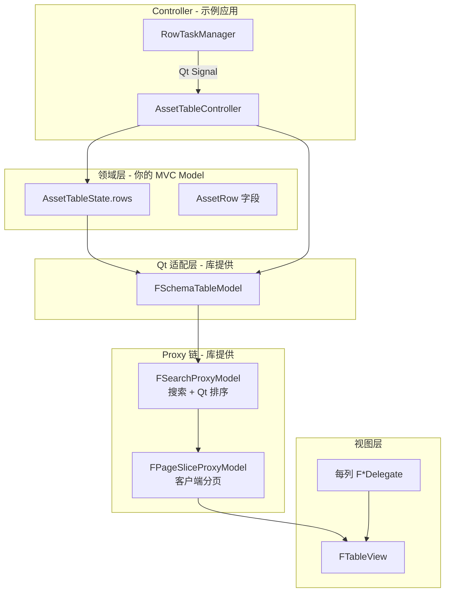
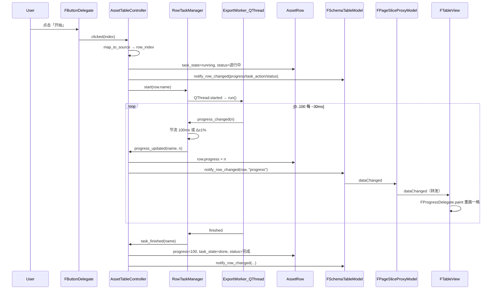

# table_full Model 链与协调机制详解

> 以 `examples/table_full/` 为例，说明 Qt Model/Proxy/View/Delegate 如何协作，以及搜索、分页、排序、进度条更新的完整路径。

相关文档：[row / column / cell / index / role 基础概念](./row_column_cell_index解释.md)

---

## 一、先建立整体图景

`table_full` 不是「一个 Model 包打天下」，而是 **分层叠加**：



**一句话**：`state.rows` 是唯一数据源；`FSchemaTableModel` 把它投影成 Qt 表格；两个 Proxy 分别做「搜索」和「分页切片」；View 只画看得见的部分；Controller 写数据和业务规则。

---

## 二、Qt Model 基础（3 个必知概念）

### 2.1 `QAbstractItemModel` — 数据的「接口规范」

任何表格 Model 都要回答 View 的问题：

| View 的问题 | Model 方法 |
|-------------|-----------|
| 有多少行/列？ | `rowCount()` / `columnCount()` |
| 第 (r,c) 格显示什么？ | `data(index, role)` |
| 用户改了格子？ | `setData(index, value, role)` |
| 表头叫什么？ | `headerData(section, orientation, role)` |
| 格子能选/能编吗？ | `flags(index)` |
| 数据变了通知谁？ | `dataChanged` / `rowsInserted` / `modelReset` 等信号 |

`FSchemaTableModel` 就是这一层的实现，读写的真实对象是 `state.rows[i].字段名`。

### 2.2 `QModelIndex` — 指向某一格的「句柄」

- `index.row()` / `index.column()`：行列号
- **Proxy 链里**：同一个业务行，在不同 Model 层 row 号可能不同（过滤、分页后会变）
- 改/删数据前，Controller 必须 `map_to_source(view_index)` 回到源 Model 行号

### 2.3 `QAbstractProxyModel` — 套在别的 Model 外面的「透明壳」

```text
View  →  问 Proxy Model  →  Proxy 转发/变换  →  Source Model  →  真实数据
```

**作用**：

1. **不复制数据**：仍然读 Source Model，只是在「行可见性」「行顺序」「行映射」上做文章
2. **索引映射**：`mapToSource(proxy_index)` / `mapFromSource(source_index)`
3. **选择性转发信号**：Source 的 `dataChanged` 要不要通知 View，取决于 Proxy 有没有正确转发

库里有两种 Proxy：

| 类 | 基类 | 职责 |
|----|------|------|
| `FSearchProxyModel` | `QSortFilterProxyModel` | 全局搜索、**Qt 内置列排序** |
| `FPageSliceProxyModel` | `QAbstractProxyModel` | 只暴露当前页的行切片 |

`QSortFilterProxyModel` 本身也是 `QAbstractProxyModel` 的子类，Qt 已经帮你实现了排序和过滤框架；`FPageSliceProxyModel` 是手写 Proxy，只负责分页。

---

## 三、table_full 里每一层 Model 是谁

### 3.1 领域层：`GlobalModel` + `AssetRow`

**文件**：`examples/table_full/models/asset_row.py`、`asset_model.py`

```python
@dataclass
class AssetRow:
    name: str
    progress: int = 0
    task_state: str = "idle"   # idle / running / cancelled / done
    task_action: str = "开始"    # 任务按钮文字
    ...

class GlobalModel:
    state: AssetTableState       # rows + project_name + ...
    table_model: FSchemaTableModel
```

- **唯一数据源**：`state.rows: list[AssetRow]`
- 不直接碰 Qt View；Controller 改 `row.xxx`，再通知 `table_model`

### 3.2 适配层：`FSchemaTableModel`

**文件**：`forza_ui/table/schema_table_model.py`

```python
FSchemaTableModel(
    schema=yaml_columns,
    rows=lambda: self._state.rows,      # 读列表
    context=lambda: self._state,        # combo 的 options_from 等
)
```

| 职责 | 说明 |
|------|------|
| 列定义 | YAML `ColumnDef` → 列数、key、cell_type |
| 读一格 | `data(index, role)` → `rows[r].{col.key}` |
| 写一格 | `setData` → 改 `AssetRow` → `cell_edited` 信号 |
| 单格刷新 | `notify_row_changed(row, field_key)` → `dataChanged` |
| 增删行 | `append_row` / `remove_row` → `beginInsertRows` 等 |

### 3.3 搜索层：`FSearchProxyModel`

**文件**：`forza_ui/table/search_page.py`

```text
FSchemaTableModel  →  setSourceModel  →  FSearchProxyModel
```

**不改** `state.rows`，只决定「哪些 source 行对 View 可见」。

### 3.4 分页层：`FPageSliceProxyModel`

**文件**：同上

```text
FSearchProxyModel  →  setSourceModel  →  FPageSliceProxyModel  →  FTableView（分页开启时）
```

**不改**数据，只决定「当前页显示 source 的哪一段行」。

### 3.5 组装：`FTableViewSet`

**文件**：`forza_ui/table/table_set.py`

```python
view_set = (
    FTableViewSet(schema)
    .searchable()
    .paginated([10, 25, 50])
)
view_set.set_source_model(model.table_model)
```

| 调用 | View 绑定的 Model | 实际链 |
|------|-------------------|--------|
| 默认 | `FSearchProxyModel` | Source → SearchProxy → View |
| `.paginated()` | `FPageSliceProxyModel` | Source → SearchProxy → PageSlice → View |

---

## 四、Model 链如何协调工作（读一格的完整路径）

以「当前页第 2 行、progress 列、DisplayRole」为例：

```text
1. FProgressDelegate.paint(..., index)
      index 属于 FPageSliceProxyModel（分页开启时）

2. index.model().data(index, EditRole)
      FPageSliceProxyModel.data()
        → mapToSource(index)  得到 SearchProxy 层 index
        → SearchProxy.data() 可能再 mapToSource
        → FSchemaTableModel.data() 这里通过传入的函数对象读取row = self._rows()[index.row()]
        → rows[真实行号].progress

3. Delegate 用 QPainter 画水平进度条
```

**写/删/映射时必须反着走**：

```python
source_index = view_set.map_to_source(view_index)
row_index = source_index.row()   # 这才是 state.rows 的下标
```

`map_index_to_source()` 会循环 `mapToSource`，穿过 SearchProxy 和 PageSlice 两层。

---

## 五、搜索 — 怎么实现

### 5.1 配置（YAML）

```yaml
- key: name
  searchable: true
- key: status
  searchable: true
```

只有 `searchable: true` 的列参与全局搜索。

### 5.2 UI 接线

```python
# table_set.py
self._search_edit.textChanged.connect(self._search_proxy.set_search_pattern)
```

### 5.3 核心逻辑

```python
def set_search_pattern(self, pattern: str):
    self._search_reg = re.compile(pattern, re.IGNORECASE) if pattern else None
    self.invalidateFilter()   # 触发重新过滤
```

```python
def filterAcceptsRow(self, source_row, source_parent):
    if self._search_reg:
        matched = False
        for col in self._schema:
            if not col.searchable:
                continue
            value = source.data(source.index(source_row, col_index), DisplayRole)
            if value and self._search_reg.search(str(value)):
                matched = True
                break
        if not matched:
            return False   # 这一行被隐藏
    return True
```

**要点**：

- 搜索是 **正则、忽略大小写**，在 **source 行** 上判断
- 搜索后 `FSearchProxyModel.rowCount()` 变少，但 **`state.rows` 长度不变**
- 搜索变化 → `search_changed` → 分页重置到第 1 页（`table_set._on_search_changed`）

---

## 六、分页 — 怎么实现

### 6.1 思路

假设搜索后有 36 行，`page_size=10`，第 2 页：

| 概念 | 值 |
|------|-----|
| offset | (2-1) × 10 = 10 |
| Proxy 可见行数 | min(10, 36-10) = 10 |
| Proxy row 0 | 对应 Source row 10 |
| Proxy row 9 | 对应 Source row 19 |

### 6.2 关键代码

```python
def _offset(self):
    return (self._page - 1) * self._page_size

def rowCount(self):
    remaining = max(0, source.rowCount() - self._offset())
    return min(self._page_size, remaining)

def mapToSource(self, proxy_index):
    return source.index(proxy_index.row() + self._offset(), proxy_index.column())
```

### 6.3 分页 UI（`FPage`）

- 用户改页码 / 每页条数 → `page_changed(page_size, current_page)`
- `table_set._on_page_changed` → `page_slice.set_page(current_page, page_size)`
- `layoutChanged` → View 重绘当前页

### 6.4 总数统计

```python
# 分页条上的 "1 - 10 of 36" 用的是搜索后的行数
self._page.set_total(self._search_proxy.rowCount(), ...)
```

### 6.5 `dataChanged` 转发（进度条实时刷新靠这个）

分页 Proxy **必须**把 Source 的单格更新转发给 View；表头排序通过 `sort()` 转发至 `FSearchProxyModel`：

```python
def sort(self, column, order):
    self.sourceModel().sort(column, order)
```

分页 Proxy **必须**把 Source 的单格更新转发给 View：

```python
# FPageSliceProxyModel._on_source_data_changed
source.dataChanged(top, bottom, roles)
  → mapFromSource 每个 cell
  → 若在当前页可见，emit 本层 dataChanged
```

若缺少这一步：数据已变，但 View 不知道要重画，只有滚动/鼠标移动时才「碰巧」刷新。

---

## 七、排序 — 怎么实现

### 7.1 表头点击排序（Qt 内置）

`FTableView` 构造时：

```python
self.setSortingEnabled(True)   # display/item_view.py
```

表头是可点击的 `FHeaderView`。当 View 绑定的 Model 是 **`QSortFilterProxyModel`** 时，点击列头会触发 Qt 内置排序：

```text
用户点击列头
  → QTableView 调用 model.sort(column, order)
  → QSortFilterProxyModel 对 source 行重新排列（虚拟排序，不改 state.rows 顺序）
  → lessThan(left, right) 比较两行的 data(DisplayRole)
```

**重要**：

| 场景 | 排序是否生效 |
|------|-------------|
| **未开分页**（View → `FSearchProxyModel`） | ✅ 点击表头可排序 |
| **开了分页**（View → `FPageSliceProxyModel`） | ✅ `FPageSliceProxyModel.sort()` 转发至 `FSearchProxyModel` |

### 7.2 YAML 初始排序指示器（不是自动排序）

```yaml
- key: name
  order: asc    # 或 desc
```

`apply_column_layout()` 只设置表头 **箭头图标**：

```python
header.setSortIndicator(col_index, AscendingOrder)
```

**不会自动调用 `sort()`**。若需要启动时就有序，Controller 里需显式：

```python
view_set.search_proxy_model.sort(col, Qt.AscendingOrder)
```

### 7.3 排序比较的是什么值

默认 `QSortFilterProxyModel.lessThan()` 用 **`DisplayRole`** 字符串比较。

- 数字列（count）按字符串排可能 `"10" < "2"`，若需数值排序需自定义 `lessThan`
- 日期列若 `DisplayRole` 是 `"yyyy-MM-dd"` 字符串，字典序通常可用
- progress 列 `DisplayRole` 与 `EditRole` 都是数字，显示为整数

### 7.4 排序 vs 搜索 vs 分页 的顺序

```text
Source 全部行
  → SearchProxy：搜索（隐藏不符合的行）
  → SearchProxy：排序（改变可见行的展示顺序）
  → PageSlice：取当前页切片
  → View 显示
```

**`state.rows` 的 list 顺序始终不变**；排序只影响 Proxy 层的展示顺序。

---

## 八、Delegate 层 — Model 之外的「画法」

Model 管 **数据**；Delegate 管 **怎么画、怎么编**。

```python
view_set.configure_delegates(badge_policies=...)
# registry.py 按 schema cell_type 注册：
# text → FLineEditDelegate
# progress → FProgressDelegate
# button → FButtonDelegate
# ...
```

| 列 | Delegate | 读 Model 的方式 |
|----|----------|----------------|
| progress | `FProgressDelegate` | `EditRole`→数值；`ProgressStatusRole`→颜色 |
| task_action | `FButtonDelegate` | `DisplayRole`→按钮文字；`ButtonTypeRole`→样式 |
| detail_action | `FButtonDelegate` | 固定「详情」 |
| action | `FButtonDelegate` | 固定「删除」 |

按钮列 **不写 Model**：`FButtonDelegate.clicked(index)` → Controller 处理。

---

## 九、进度条更新与控制 — 完整链路

这是 table_full 里最典型的 **「子线程 → MVC → 单格刷新」** 流程。

### 9.1 涉及组件

| 组件 | 文件 | 职责 |
|------|------|------|
| `RowTaskManager` | `services/row_task_manager.py` | 每行 QThread + 节流 |
| `AssetTableController` | `controllers/asset_table_controller.py` | 写 state、通知 Model |
| `FSchemaTableModel` | 库 | `notify_row_changed` |
| `FPageSliceProxyModel` | 库 | 转发 `dataChanged` |
| `FProgressDelegate` | 库 | `paint()` 读 progress |

### 9.2 状态机（任务按钮列）

| `task_state` | 按钮文字 | 点击行为 |
|--------------|----------|----------|
| idle | 开始 | 启动线程 |
| running | 取消 | `worker.cancel()` |
| done / cancelled | 开始 | 重置 progress，再启动 |

字段在 `AssetRow`：`progress`、`task_state`、`task_action`、`task_btn_type`、`task_status`。

### 9.3 启动任务



### 9.4 为什么必须走 Controller，不能在线程里直接改 Model

```python
# ❌ 错误：子线程直接碰 Qt Model
self._model.table_model.notify_row_changed(i, "progress")

# ✅ 正确：Worker emit Qt Signal → Controller（UI 线程）→ 改 state → notify
worker.progress_changed.connect(...)  # 跨线程用 QueuedConnection
```

Qt 的 Model/View **应在 GUI 线程**更新。

### 9.5 节流（性能）

`RowTaskManager`：

- 同一行至少间隔 **100ms** 才向 UI 发一次
- 或进度变化 **≥ 1%**
- `0` 和 `100` 始终立即发送

避免 101 次/3 秒 × 多行并行时信号过多。

### 9.6 单格刷新 API

```python
def notify_row_changed(self, row_index, field_key):
    idx = self.index(row_index, self.column_index(field_key))
    roles = [DisplayRole, EditRole]
    if progress 列: roles += [ProgressStatusRole]
    if button 列: roles += [ButtonTypeRole]
    self.dataChanged.emit(idx, idx, roles)
```

**禁止**为改一个数而 `beginResetModel()` — 会整表重建，极慢。

### 9.7 并行多行

- 每行独立 `QThread` + `ExportWorker`，用 `row.name` 作 task 字典键（删行后 index 会变，name 更稳）
- 删行 / 关窗：`task_manager.stop(name)` / `stop_all()`

---

## 十、其他交互路径（补充知识点）

### 10.1 用户编辑单元格

```text
Delegate.setModelData
  → FSchemaTableModel.setData
  → 改 AssetRow
  → dataChanged + cell_edited(row, key, value)
  → AssetTableController._on_cell_edited 执行业务规则
```

### 10.2 详情抽屉（按钮触发，非选中行）

```text
detail_action 列 FButtonDelegate.clicked
  → Controller._on_detail_clicked
  → map_to_source → detail_panel.set_row → drawer.open()
```

### 10.3 删除行

```text
action 列「删除」
  → stop 该行任务
  → table_model.remove_row(row_index)   # 改 state.rows + beginRemoveRows
  → Proxy 链 rowCount 变化 → 分页总数更新
```

### 10.4 增行

```python
model.append_row(AssetRow(...))  # beginInsertRows
```

### 10.5 `cell_edited` vs `dataChanged`

| 信号 | 谁发 | 用途 |
|------|------|------|
| `dataChanged` | Qt Model 标准 | 告诉 View 重画 |
| `cell_edited` | `FSchemaTableModel` 自定义 | 告诉 Controller 做业务规则 |

进度更新 **只发 dataChanged**（通过 `notify_row_changed`），不发 `cell_edited`（不是用户编辑）。

### 10.6 配置驱动列（YAML → 全局）

`load_column_schema("config/assets_table.yaml")` 决定：

- 列数、标题、宽度
- `cell_type` → Delegate 类型
- `searchable` → 搜索参与列
- `min` / `max` → progress、spin 的范围

---

## 十一、文件索引（table_full + 库）

| 路径 | 说明 |
|------|------|
| `examples/table_full/main.py` | 入口 |
| `examples/table_full/models/asset_row.py` | 领域数据结构 |
| `examples/table_full/models/asset_model.py` | GlobalModel + FSchemaTableModel |
| `examples/table_full/controllers/asset_table_controller.py` | 全部业务接线 |
| `examples/table_full/services/row_task_manager.py` | 后台任务 |
| `examples/table_full/config/assets_table.yaml` | 列配置 |
| `forza_ui/table/schema_table_model.py` | Qt 表格适配 Model |
| `forza_ui/table/search_page.py` | 搜索/分页 Proxy |
| `forza_ui/table/table_set.py` | FTableViewSet 组合件 |
| `forza_ui/navigation/page.py` | 分页条 UI |
| `forza_ui/delegates/progress_delegate.py` | 进度列绘制 |
| `forza_ui/delegates/registry.py` | 列 → Delegate 注册 |

---

## 十二、常见问题速查

| 现象 | 可能原因 |
|------|----------|
| 改了数据 UI 不刷新 | Proxy 未转发 `dataChanged`（分页层已修复） |
| 删行删错 | 未 `map_to_source`，用了 Proxy 行号 |
| 搜索后行号乱了 | 应用层应始终用 source row 或 row.name，不用 View 行号做持久 key |
| 进度条不实时动 | 检查是否 `notify_row_changed`；检查 PageSlice 是否转发信号 |
| 表头排序无效 | 分页模式下 View 绑 PageSlice；确认 `FPageSliceProxyModel.sort()` 已转发至 SearchProxy |
| 搜索后总数不对 | 分页 total 应读 `_search_proxy.rowCount()`，不是 `len(state.rows)` |

---

## 十三、心智模型总结

```text
┌─────────────────────────────────────────────────────────┐
│  AssetRow / state.rows          ← 唯一真相（领域层）     │
└───────────────────────────┬─────────────────────────────┘
                            │
┌───────────────────────────▼─────────────────────────────┐
│  FSchemaTableModel              ← Qt 适配：data/setData   │
└───────────────────────────┬─────────────────────────────┘
                            │ dataChanged / rows*
┌───────────────────────────▼─────────────────────────────┐
│  FSearchProxyModel              ← 搜索 + 排序          │
└───────────────────────────┬─────────────────────────────┘
                            │
┌───────────────────────────▼─────────────────────────────┐
│  FPageSliceProxyModel           ← 当前页切片+信号转发     │
└───────────────────────────┬─────────────────────────────┘
                            │
┌───────────────────────────▼─────────────────────────────┐
│  FTableView + Delegates         ← 只负责显示/编辑 UI      │
└─────────────────────────────────────────────────────────┘
                            ▲
┌───────────────────────────┴─────────────────────────────┐
│  Controller + RowTaskManager    ← 业务规则、线程、抽屉    │
└─────────────────────────────────────────────────────────┘
```

**记住三句话**：

1. **数据只活在 `state.rows`**，Proxy 不复制、不改 list。
2. **View 的 index 要经过 `map_to_source` 才能当业务行号用**。
3. **后台更新走 Signal → Controller → `notify_row_changed`**，让 Proxy 把 `dataChanged` 一路传到 View。
